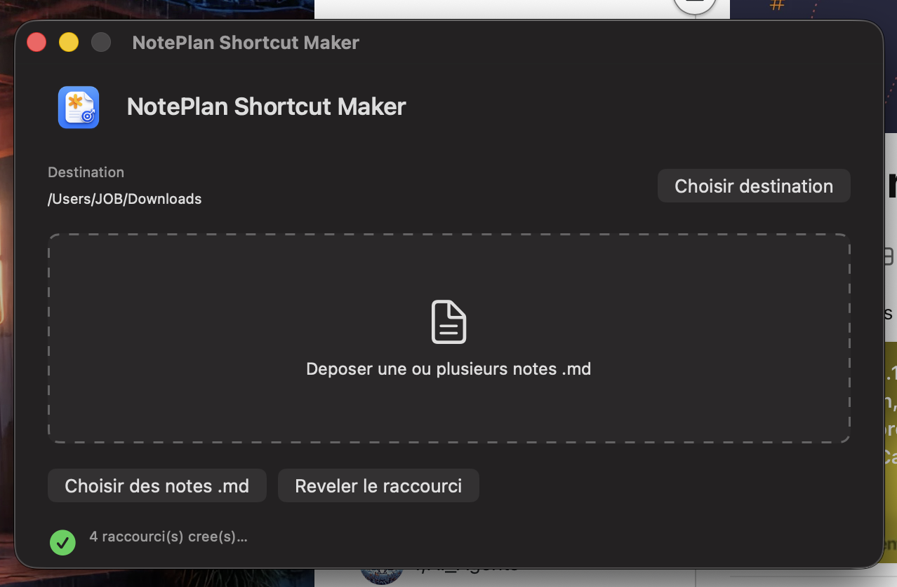

# NotePlan Shortcut Maker v3

App macOS SwiftUI minimale pour creer des raccourcis `.app` depuis des notes NotePlan `.md`.
Le logo est affiche dans l'app generateur, mais les raccourcis generes restent sans image ni icone.



## Regle v3

V3 genere uniquement des raccourcis sans icone personnalisee, sans image et sans logo embarque.
Le generateur lui-meme embarque seulement un petit logo 128 px.

Exemple :

- note : `TODO Suisse.md`
- raccourci : `DESTINATION/TODO Suisse.app`
- URL : `noteplan://x-callback-url/openNote?filename=TODO%20Suisse.md`

Si la note vient du dossier NotePlan `Notes/`, l'URL utilise le chemin relatif complet.
Exemple :

- note : `Notes/!!! Rapide/_Todo/TODO Suisse.md`
- raccourci : `DESTINATION/TODO Suisse.app`
- URL : `noteplan://x-callback-url/openNote?filename=!!!%20Rapide/_Todo/TODO%20Suisse.md`

La note `.md` n'est jamais modifiee, copiee ou deplacee.

## Lancer

```bash
./build-app.sh
open "dist/NotePlan Shortcut Maker.app"
```

Pour installer :

```bash
rm -rf "/Applications/NotePlan Shortcut Maker.app"
cp -R "dist/NotePlan Shortcut Maker.app" "/Applications/NotePlan Shortcut Maker.app"
open "/Applications/NotePlan Shortcut Maker.app"
```

## Utilisation

1. Par defaut, la destination est `~/Downloads`.
2. Optionnel : cliquer sur `Choisir destination` pour changer de dossier.
3. Deposer une ou plusieurs notes `.md`.
4. Confirmer le remplacement si des `Nom.app` existent deja.
5. Cliquer sur `Reveler le raccourci`.

Fallback : `Choisir des notes .md` utilise le meme generateur que le drag & drop.

## Verification

```bash
./test-generation.sh
```

Le test verifie :

- generation simple
- remplacement sans `Nom 2.app`
- noms accentues NFC
- generation batch
- chemin relatif NotePlan via `filename=`
- absence de `CFBundleIconFile`
- absence de `CFBundleIconName`
- absence de `applet.icns`
- absence de `CustomIcon.icns`
