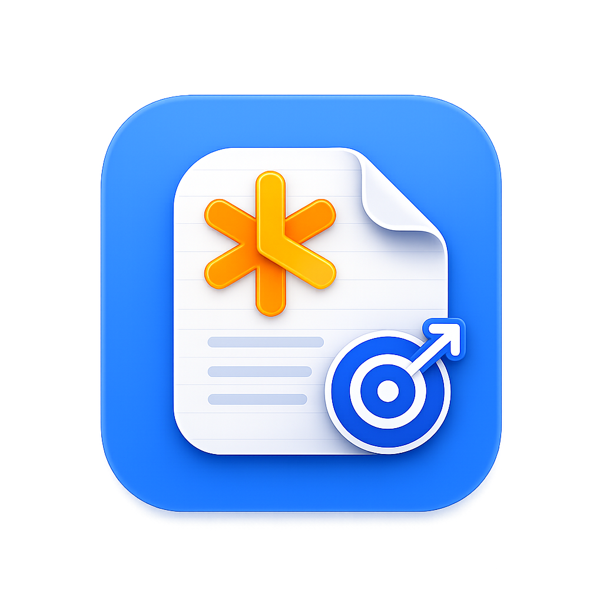

# NotePlan Shortcut Maker



App macOS SwiftUI minimale pour creer un raccourci `.app` depuis une note NotePlan `.md`.

Source active : `Sources/NotePlanShortcutMaker/main_v2.0.swift`. Le drop Finder est gere par
une `NSView` AppKit native (`registerForDraggedTypes`, lecture via `NSPasteboard.readObjects`),
pas par `.onDrop`/`NSItemProvider` (peu fiable pour les drags Finder). Ancienne version
SwiftUI `.onDrop` archivee a plat : `main_v1.0.swift` (racine du projet, non compilee).

## Regle

Une note deposee cree un raccourci du meme nom.

Exemple :

- note : `TODO Suisse.md`
- raccourci : `DESTINATION/TODO Suisse.app`
- URL : `noteplan://x-callback-url/openNote?noteTitle=TODO%20Suisse`

La note `.md` n'est jamais modifiee, copiee ou deplacee.

## Lancer

```bash
./build-app.sh
open "dist/NotePlan Shortcut Maker.app"
```

Pour installer :

```bash
rm -rf "/Applications/NotePlan Shortcut Maker.app"
cp -R "dist/NotePlan Shortcut Maker.app" "/Applications/NotePlan Shortcut Maker.app"
open "/Applications/NotePlan Shortcut Maker.app"
```

## Utilisation

1. Cliquer sur `Choisir destination`.
2. Optionnel : activer `Icone personnalisee` et choisir une image PNG/JPG/TIFF/ICNS.
3. Deposer une note `.md`.
4. Confirmer le remplacement si `Nom.app` existe deja.
5. Cliquer sur `Reveler le raccourci`.

Fallback : `Choisir une note .md` utilise le meme generateur que le drag & drop.

### Icone personnalisee

L'image choisie est optimisee automatiquement en `.icns` avec une taille maximale de
512 px. Le generateur n'embarque pas l'image source complete dans le raccourci cree.

Sans icone personnalisee, le generateur supprime l'icone AppleScript par defaut pour
reduire le poids du raccourci cree.

## Verification

```bash
./test-generation.sh
```

Le test compile le binaire puis l'appelle via un mode CLI cache (`--cli-generate note.md dest/`),
qui declenche exactement le meme `NotePlanShortcutGenerator.generate()` que le drag & drop et le
bouton `Choisir une note .md`. Il verifie :

- `TODO Suisse.app`
- absence de `TODO Suisse 2.app`, y compris en relancant sur la meme note (doit remplacer en place)
- `CFBundleName`
- `CFBundleDisplayName`
- URL NotePlan stockee dans `NotePlanShortcutURL`
- cas accentue : `Été & idées.app`, avec verification des octets exacts (NFC, pas NFD)
- icone personnalisee optimisee et referencee par `CFBundleIconFile = CustomIcon`
- absence d'icone par defaut quand aucune icone personnalisee n'est choisie

Ce script ne teste pas le geste de drag & drop lui-meme (mecanique AppKit
`draggingEntered`/`performDragOperation`) : ca a ete verifie manuellement avec un vrai
drag Finder -> fenetre de l'app pendant le developpement.

### Piege Unicode (NFC vs NFD)

Sur macOS, `URL.lastPathComponent`, `FileManager` et les arguments passes a `Process`
decomposent silencieusement les caracteres accentues (NFD : `e` + accent combinant) meme
quand le fichier source est en NFC (`é` precompose). Consequence si on ignore ca : l'URL
NotePlan et le `.app` genere pour `Été & idées.md` auraient des octets differents de ce que
l'utilisateur a tape, alors qu'ils s'affichent pareil a l'ecran. Le generateur recompose le
nom en NFC des l'extraction, ecrit les valeurs du plist via `PropertyListSerialization`
(pas `plutil` en sous-processus) et renomme le `.app` final avec le syscall `rename()` brut
plutot que `FileManager` — les trois seules methodes qui preservent les octets NFC.
